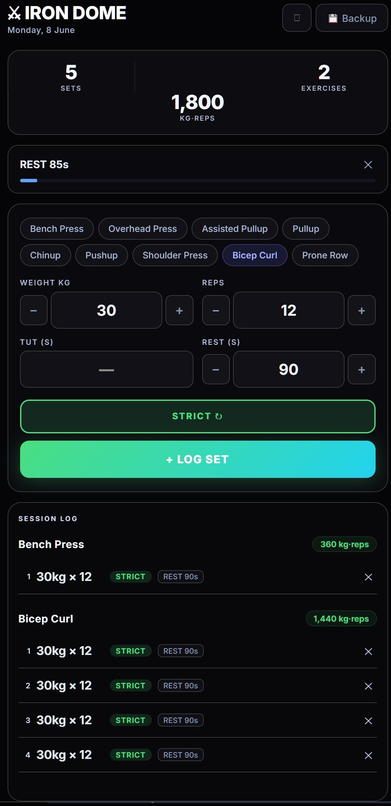

# Iron Dome



Personal gym session tracker built for daily use. Logs sets with execution quality, tracks rest periods, syncs to Supabase, and exports session data as CSV or JPEG.

## Features

- **Session logging** — weight, reps, TUT (time under tension), rest time per set
- **Execution modes** — tag each set as Strict / Controlled / Momentum / Assisted
- **Rest timer** — countdown with push notification when rest is done
- **Real-time sync** — Supabase persists every session automatically with debounced saves
- **Auto daily backup** — triggers at 19:00 or on app focus, exports CSV + JPEG silently
- **CSV export** — daily / weekly / monthly / YTD
- **Screenshot export** — save session log as JPEG via html2canvas
- **PWA** — installable on mobile, service worker for background backup scheduling

## Stack

- React 18 + Vite
- Supabase (Postgres)
- html2canvas
- Service Worker / PWA

## Exercise catalog

Bench Press · Overhead Press · Assisted Pullup · Pullup · Chinup · Pushup · Shoulder Press · Bicep Curl · Prone Row

## Run locally

```bash
npm install
npm run dev
```

Requires a Supabase project with a `workouts` table:

```sql
create table workouts (
  id uuid primary key,
  data jsonb,
  created_at timestamptz default now()
);
```

Add your Supabase URL and anon key to `src/supabaseClient.js`.
